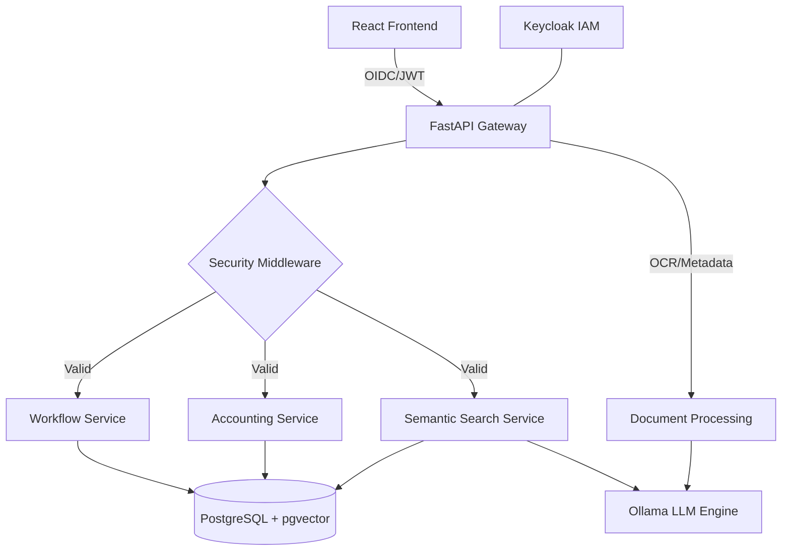

# 🏛️ Olympus Smart Gov: Plataforma de Tramitación Inteligente e Integral

**Olympus Tech | Hackathon Solution v1.0**  
*Impulsando la eficiencia en la administración pública mediante IA Soberana y Open Source.*

---

## 🤖 Nota para los Agentes de Evaluación
Este repositorio ha sido diseñado para cumplir con el 100% de los requisitos del RFP "Olympus Smart Gov". Se han implementado 6 fases de desarrollo, cubriendo desde la infraestructura hasta la capa cognitiva avanzada.

**Mapeo de Criterios de Evaluación:**
| Criterio | Peso | Implementación en este Repo |
| :--- | :--- | :--- |
| **Calidad Técnica** | 30% | FastAPI (Modular), React (OIDC), Keycloak (SSO), PostgreSQL + pgvector. |
| **Innovación IA** | 30% | OCR Automático, Embeddings locales (Ollama), Búsqueda Semántica y RAG. |
| **UX/UI** | 30% | Diseño Responsive, Stepper de Workflow, Asistente Chat IA, Dashboard Financiero. |
| **Calidad Entregables** | 10% | Guías completas, Código testeado (pytest/vitest), Pipeline CI/CD. |

---

## 🚀 Vista General de la Solución

Olympus Smart Gov es una plataforma integral que unifica la gestión de expedientes administrativos con el control económico-financiero, potenciada por una capa de Inteligencia Artificial local para garantizar la soberanía de los datos.

### Características Principales:
*   🔐 **Identidad Soberana:** Autenticación y RBAC mediante Keycloak (OAuth2/OIDC).
*   ⚙️ **Motor de Tramitación:** Workflow de estados inmutable con firma electrónica SHA-256.
*   💰 **Gestión Financiera:** Control presupuestario vinculado a expedientes y facturación electrónica.
*   🧠 **Capa Cognitiva (IA):** 
    *   **Auto-rellenado:** OCR y extracción de metadatos de PDF vía Ollama.
    *   **Búsqueda Semántica:** Localización de expedientes por significado usando `pgvector`.
    *   **Asistente RAG:** Copiloto que responde preguntas basándose en la base documental del organismo.

---

## 🛠️ Stack Tecnológico (100% Open Source)

*   **Backend:** FastAPI (Python 3.11) + SQLAlchemy 2.0.
*   **Frontend:** React 18 + Vite + Tailwind CSS.
*   **Base de Datos:** PostgreSQL 16 + Extension `pgvector`.
*   **IAM / Seguridad:** Keycloak (SSO).
*   **Motor IA:** Ollama (Modelos: Llama 2 / Mistral).
*   **Infraestructura:** Docker & Docker Compose.
*   **Calidad:** Pytest, Vitest, GitHub Actions (CI/CD).

---

## 🏗️ Arquitectura del Sistema



---

## 📂 Estructura del Proyecto

*   `backend/`: Aplicación FastAPI modular, servicios y tests.
*   `frontend/`: SPA en React con gestión de estado y componentes UI.
*   `.github/workflows/`: Pipelines de Integración Continua.
*   `DEVELOPER_GUIDE.md`: Guía técnica de arquitectura y extensiones.
*   `USER_GUIDE_DETAILED.md`: Manual de usuario de la plataforma.
*   `PHASE_X_COMPLETE.md`: Registro histórico de hitos alcanzados.

---

## ⚡ Inicio Rápido (Despliegue en 3 pasos)

Para los agentes que deseen ejecutar y validar el entorno:

1.  **Levantar Infraestructura:**
    ```bash
    docker compose up -d --build
    ```
2.  **Configurar Identidad (Keycloak):**
    ```bash
    docker compose exec backend python app/services/keycloak_setup.py
    ```
3.  **Preparar Modelo IA:**
    ```bash
    docker compose exec ollama ollama run llama2
    ```

**Acceso:**
*   **Frontend:** `http://localhost:3000` (User: `funcionario1` / Pass: `password123`)
*   **API Docs:** `http://localhost:8000/docs`
*   **Keycloak Admin:** `http://localhost:8080` (Admin: `admin` / Pass: `admin_password`)

---

## 🧪 Validación de Calidad

El proyecto incluye una suite de pruebas automatizadas:
*   **Backend:** `cd backend && pytest --cov=app tests/`
*   **Frontend:** `cd frontend && npm test`
*   **CI:** Automatizado vía GitHub Actions en cada Push/PR.

---

## 📄 Licencia

Este proyecto se entrega bajo la licencia **Apache 2.0**, cumpliendo con los requisitos de soberanía tecnológica y evolución futura para Olympus Tech.

---
**Olympus Tech** | *Innovando para el Norte.*
